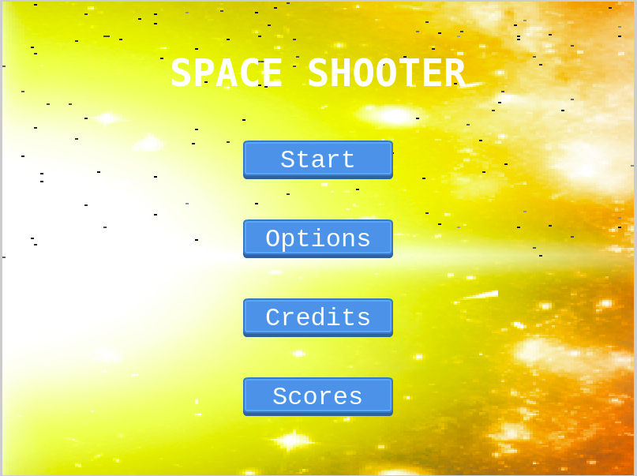
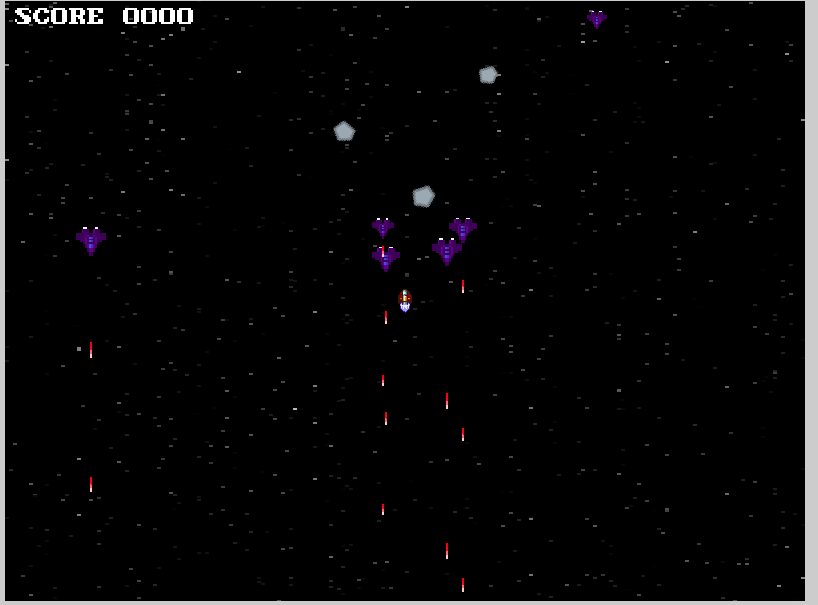
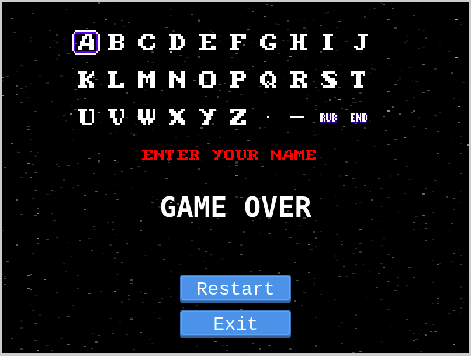
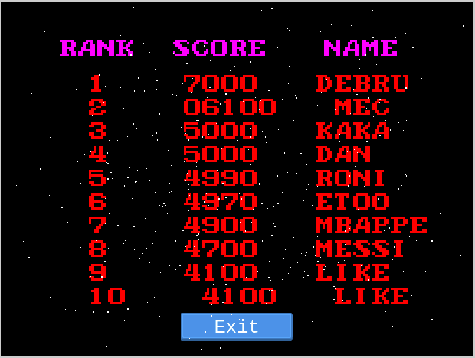

# Shooter-Game-JS

A video game using JavaScript and the game engine Phaser

<!--
*** Thanks for checking out this README Template. If you have a suggestion that would
*** make this better, please fork the repo and create a pull request or simply open
*** an issue with the tag "enhancement".
*** Thanks again! Now go create something AMAZING! :D
-->

<!-- PROJECT SHIELDS -->
<!--
*** I'm using markdown "reference style" links for readability.
*** Reference links are enclosed in brackets [ ] instead of parentheses ( ).
*** See the bottom of this document for the declaration of the reference variables
*** for contributors-url, forks-url, etc. This is an optional, concise syntax you may use.
*** https://www.markdownguide.org/basic-syntax/#reference-style-links
-->

[![Contributors][contributors-shield]][contributors-url]
[![Forks][forks-shield]][forks-url]
[![Stargazers][stars-shield]][stars-url]
[![Issues][issues-shield]][issues-url]

<!-- PROJECT LOGO -->
<br />
<p align="center">
  <a href="https://github.com/ericmbouwe/shooter-game-js">
    
  </a>
  
  <h3 align="center">The Shooter Game Application</h3>
  
  <p align="center">
    This project is part of the Microverse curriculum in JavaScript course!
    <br />
    <a href="https://github.com/ericmbouwe/shooter-game-js"><strong>Explore the docs</strong></a>
    <br />
    <a href="https://ericmbouwe.github.io/shooter-game-js/">Live Version</a>
    <br />
    <a href="https://github.com/ericmbouwe/shooter-game-js/issues">Report Bug</a>
    <span> - </span>
    <a href="https://github.com/ericmbouwe/shooter-game-js/issues">Request Feature</a>
  </p>
</p>

This is an arcade Shooter Game application where the player mission is to shoot enemies coming down from the top of the screen

<hr />

<!-- TABLE OF CONTENTS -->

## Table of Contents

- [Screen Shots](#screen-shots)
- [About the Project](#about-the-project)
- [Application Instructions](#application-instructions)
- [How to play](#how-to-play)
- [Live Version](#live-version)
- [System Requierments](#system-requierments)
- [Development and Dependencies](#development-and-dependencies)
- [Built With](#built-with)
- [Contributors](#contributors)
- [Acknowledgements](#acknowledgements)

## Screen Shots

### Entry Scene


<hr />

### Battle Scene


<hr />

### Game Over Scene


<hr />

### Leadersboard Scene


<hr />
<!-- ABOUT THE PROJECT -->

## About The Project

The project uses the phaser3 game engine and almost all the code is related to this framework  
 Webpack is used to compile src folder content and outputs to dist folder to mimify the whole package code

Game scenes:

    - BootScene that start the game

    - PreloaderScene loads all the assets that we will need in our game

    - TitleScene Shows the main menu game, there you can choose either you want to start playing by clicking on the play button or apply some custom settings before starting to play

    - GameScene is the game itself it shows the battlefield(the space) and the different actors in action

    - GameOverScene appears when the player loose the game(die) and display buttons to restart the game, exit and see the leaderboard

    -LeaderboardScene show the top 10 scores achieved by different players

    - Some objects have been created to build the connection between all our classes and fulfill the logic of this game

        Located in scr/Objects folder, we have:

      - Hero (Player.js and PlayerLaser.js)

      - Enemies (CarrierShip.js, ChaserShip.js, Gunship.js and  EnemyLaser.js)

      - Button.js

      - Entities (The base class of our game principal objects(Hero and Enemies))

      - Scores.js handle the score

      - ScrollingBackground.js

<hr/>

<!-- ABOUT THE PROJECT -->

## Application Instructions

- In the Title scene click Play to start the game or click Leadersboard to see the top 10 user's scores

- In the Game scene use the keyboard arrows to move in 2 dimensions and the space bar to shoot weapons against the enemy ships that are coming down from the screen top. You start with a score zero shown on top of the screen
  Being touch by enemy laser or crashing your ship on an enemy ship you die

  There are 3 types of enemy ships :

  - The CarrierShip, that shoots lasers. A new one appears every 2 seconds. You have to avoid the lasers else you lose. Destroying an Alien Ship you get 100 points.

  - The GunShip, that chases your ship and shooting it you get 200 points. A new one appears every 5 seconds

  - The ChaserShip that just comes down the screen. Shooting it you gain 400 points. A new one appears every 7 seconds

- If you die, the GameOver scene appears. If there is a score achieved then an input form appears to enter your name first and then the score is submitted to the remote score API. In the GameOver scene, you can restart a new game session or select LeadersBoard scene

- The LeadersBoard scene shows only the top 10 scores

<hr/>

## How to play

The Hero needs to kill enemies, avoid them and their lazers

### Control's

- (←) left arrow key => Move left
- (→) right arrow key => Move right
- (↑) up arrow key => Mpve up
- (↓) down arrow key => Move down
- (Space) key => Attack enemy

## Live Version

[Demo LIVE](https://raw.githack.com/EricMbouwe/Shooter-Game-JS/game-logic/webpack/dist/index.html)

<hr/>

## System Requierments

- JavaScript Enabled
- You need to Disable Cross-Origin-Restrictions from your browser if you want to open the index.html from your file system without using a server.

<hr/>

## Development and Dependencies

- Clone the project

```
  git clone https://github.com/ericmbouwe/shooter-game-js.git

  Use VSCode and Live Server to show index.html

```

- Since webpack is used, In your terminal run

```
npm install

npm run dev

npm run build

npm start
```

<hr/>

## Tests

In your terminal, run

```
npm jest
```

## Built With

This project was built using these technologies.

- Phaser3
- JavaScript (ES6)
- HTML5
- CSS3
- webpack
- APIs
- Git - GitHub
- ESLint
- Stylelint
- Jest

<hr/>

<!-- CONTACT -->

## Contributors

:bust_in_silhouette:
​

## Eric Mbouwe

- Github: [@ericmbouwe](https://github.com/ericmbouwe)
- Twitter: [@ericmbouwe](https://twitter.com/ericmbouwe)
- Linkedin: [Eric Mbouwe](https://www.linkedin.com/in/ericmbouwe)
- E-mail: ericmbouwe@gmail.com
​
<hr/>
<!-- ACKNOWLEDGEMENTS -->

## Acknowledgements

- [Microverse](https://www.microverse.org/)
- [The Odin Project](https://www.theodinproject.com/)

<!-- MARKDOWN LINKS & IMAGES -->
<!-- https://www.markdownguide.org/basic-syntax/#reference-style-links -->

[contributors-shield]: https://img.shields.io/github/contributors/ericmbouwe/shooter-game-js.svg?style=flat-square
[contributors-url]: https://github.com/ericmbouwe/shooter-game-js/graphs/contributors
[forks-shield]: https://img.shields.io/github/forks/ericmbouwe/shooter-game-js.svg?style=flat-square
[forks-url]: https://github.com/ericmbouwe/shooter-game-js/network/members
[stars-shield]: https://img.shields.io/github/stars/ericmbouwe/shooter-game-js.svg?style=flat-square
[stars-url]: https://github.com/ericmbouwe/shooter-game-js/stargazers
[issues-shield]: https://img.shields.io/github/issues/ericmbouwe/shooter-game-js.svg?style=flat-square
[issues-url]: https://github.com/ericmbouwe/shooter-game-js/issues
